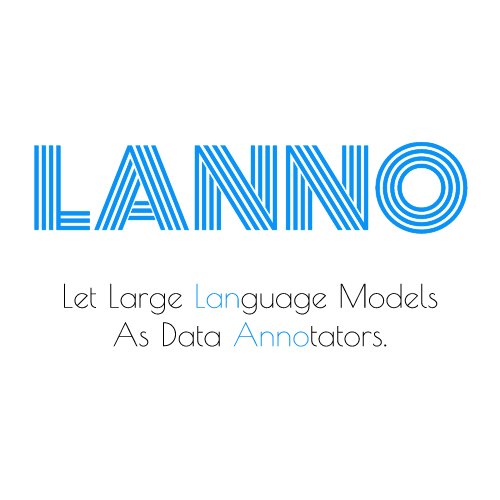

<p align='center'></p>

<p align='center'>Let Large <strong style='color: #0a93f5'>Lan</strong>guage Models Serve As Data <strong style='color: #0a93f5'>Anno</strong>tators.</p>


 <h4 align="center">
  <a href="https://github.com/SeanLee97/lanno/blob/main/LICENSE">
    
  </a>
  <a href="https://pypi.org/project/lanno/">
    
  </a>
  <a href="http://makeapullrequest.com">
    
  </a>
</h4>

# Installation

**stable**
```bash
python -m pip install -U lanno
```

For Chinese users, the index-url can be specified for a faster installation.

```bash
python -m pip install -i https://pypi.tuna.tsinghua.edu.cn/simple -U lanno
```

**latest**
```bash
python -m pip install git+https://github.com/SeanLee97/lanno.git
```

💡 Currently, supports `Python3.8+`. Due to `Python 3.7`'s [end-of-life](https://endoflife.date/python) on June 27, 2023, we no longer support it.

# Features 📦

- 🕸 Converts unstructured data into structured data using powerful LLMs (Large Language Models).
- 📑 Provides annotated data that can be used for further training or annotation refinement.
- 💡 API is simple to use and out of the box.
- 🗂️ Supports a wide range of tasks.
- 🌍 Supports multilingual prompts.


**Supporting Tasks:**

| Task Name                 | Supporting Languages                       | Status |
|---------------------------|-----------------------------------------|--------|
| NER                       | English (EN), Simplifed Chinese (ZH_CN) |    👌   |
| Text Classification (Binary, MultiClass)       |                 🏗️                        |    🏗️    |
| MultiLabel Classification |                   🏗️                      |   🏗️     |
| Relation Extraction       |                    🏗️                     |    🏗️    |
| Summarization       |                   🏗️                      |    🏗️    |
| Text to SQL       |                   🏗️                      |    🏗️    |


# Usage

## Examples

### English Example

```python
from lanno.config import Tasks, Languages, OpenAIModels, NERFormatter
from lanno import GPTModel, GPTAnnotator

print('All Supported Tasks:', Tasks.list_attributes())
print('All Supported Languages:', Languages.list_attributes())
print('All Supported NERFormatter:', NERFormatter.list_attributes())
print('All Supported OpenAIModels:', OpenAIModels.list_attributes())

api_key = 'Your API Key'
model = GPTModel(api_key, model=OpenAIModels.ChatGPT)
annotator = GPTAnnotator(model,
                         task=Tasks.NER,
                         language=Languages.EN,
                         label_mapping={
                            "people": 'PEO',
                            'location': 'LOC',
                            'company': 'COM',
                            'organization': 'ORG',
                            'job': 'JOB'})
doc = '''Elon Reeve Musk FRS (/ˈiːlɒn/ EE-lon; born June 28, 1971) is a business magnate and investor. He is the founder, CEO and chief engineer of SpaceX; angel investor, CEO and product architect of Tesla, Inc.; owner and CEO of Twitter, Inc.; founder of The Boring Company; co-founder of Neuralink and OpenAI; and president of the philanthropic Musk Foundation. '''

# w/o hint, w/o formatted result
ret = annotator(doc)
# w/o hint, w/ formatted result
ret = annotator(doc, formatter=NERFormatter.BIO)
# w/ hint, w/ formatted result
ret = annotator(doc, hint='the entity type `job` is job title such as CEO, founder, boss.', formatter=NERFormatter.BIO)  
```

`result` is the annotation result. `formatted_result` is the formatted result. 

💡Tip: if you want to train your domain model, you can use the formatted result.
 
<details>
<summary>Click to show the result.</summary>

```json
{
  "request": {
    "prompt": "You are a NER (Named-entity recognition) system, please help me with the NER task.\nTask: extract the entities and corresponding entity types from a given sentence.\nOnly support 5 entity types, including: people, location, company, organization, job.\n\nExplanation and examples: the entity type `job` is job title such as CEO, founder, boss.\n\nOutput format: (entity, entity_type).\n\nFollowing is the given sentence: Elon Reeve Musk FRS (/ˈiːlɒn/ EE-lon; born June 28, 1971) is a business magnate and investor. He is the founder, CEO and chief engineer of SpaceX; angel investor, CEO and product architect of Tesla, Inc.; owner and CEO of Twitter, Inc.; founder of The Boring Company; co-founder of Neuralink and OpenAI; and president of the philanthropic Musk Foundation. \nOutput:"
  },
  "meta": {
    "role": "assistant",
    "prompt_tokens": 195,
    "completion_tokens": 74,
    "total_tokens": 269,
    "taken_time": 4.87583
  },
  "response": "\n\n(\"Elon Reeve Musk\", \"people\"), (\"FRS\", \"job\"), (\"SpaceX\", \"company\"), (\"Tesla, Inc.\", \"company\"), (\"Twitter, Inc.\", \"company\"), (\"The Boring Company\", \"organization\"), (\"Neuralink\", \"organization\"), (\"OpenAI\", \"organization\"), (\"Musk Foundation\", \"organization\")",
  "result": {
    "text": "Elon Reeve Musk FRS (/ˈiːlɒn/ EE-lon; born June 28, 1971) is a business magnate and investor. He is the founder, CEO and chief engineer of SpaceX; angel investor, CEO and product architect of Tesla, Inc.; owner and CEO of Twitter, Inc.; founder of The Boring Company; co-founder of Neuralink and OpenAI; and president of the philanthropic Musk Foundation. ",
    "entities": [
      [
        0,
        15,
        "Elon Reeve Musk",
        "PEO"
      ],
      [
        16,
        19,
        "FRS",
        "JOB"
      ],
      [
        139,
        145,
        "SpaceX",
        "COM"
      ],
      [
        192,
        203,
        "Tesla, Inc.",
        "COM"
      ],
      [
        222,
        235,
        "Twitter, Inc.",
        "COM"
      ],
      [
        248,
        266,
        "The Boring Company",
        "ORG"
      ],
      [
        282,
        291,
        "Neuralink",
        "ORG"
      ],
      [
        296,
        302,
        "OpenAI",
        "ORG"
      ],
      [
        339,
        354,
        "Musk Foundation",
        "ORG"
      ]
    ],
    "formatted_result": "E\tB-PEO\nl\tI-PEO\no\tI-PEO\nn\tI-PEO\n \tI-PEO\nR\tI-PEO\ne\tI-PEO\ne\tI-PEO\nv\tI-PEO\ne\tI-PEO\n \tI-PEO\nM\tI-PEO\nu\tI-PEO\ns\tI-PEO\nk\tI-PEO\n \tO\nF\tB-JOB\nR\tI-JOB\nS\tI-JOB\n \tO\n(\tO\n/\tO\nˈ\tO\ni\tO\nː\tO\nl\tO\nɒ\tO\nn\tO\n/\tO\n \tO\nE\tO\nE\tO\n-\tO\nl\tO\no\tO\nn\tO\n;\tO\n \tO\nb\tO\no\tO\nr\tO\nn\tO\n \tO\nJ\tO\nu\tO\nn\tO\ne\tO\n \tO\n2\tO\n8\tO\n,\tO\n \tO\n1\tO\n9\tO\n7\tO\n1\tO\n)\tO\n \tO\ni\tO\ns\tO\n \tO\na\tO\n \tO\nb\tO\nu\tO\ns\tO\ni\tO\nn\tO\ne\tO\ns\tO\ns\tO\n \tO\nm\tO\na\tO\ng\tO\nn\tO\na\tO\nt\tO\ne\tO\n \tO\na\tO\nn\tO\nd\tO\n \tO\ni\tO\nn\tO\nv\tO\ne\tO\ns\tO\nt\tO\no\tO\nr\tO\n.\tO\n \tO\nH\tO\ne\tO\n \tO\ni\tO\ns\tO\n \tO\nt\tO\nh\tO\ne\tO\n \tO\nf\tO\no\tO\nu\tO\nn\tO\nd\tO\ne\tO\nr\tO\n,\tO\n \tO\nC\tO\nE\tO\nO\tO\n \tO\na\tO\nn\tO\nd\tO\n \tO\nc\tO\nh\tO\ni\tO\ne\tO\nf\tO\n \tO\ne\tO\nn\tO\ng\tO\ni\tO\nn\tO\ne\tO\ne\tO\nr\tO\n \tO\no\tO\nf\tO\n \tO\nS\tB-COM\np\tI-COM\na\tI-COM\nc\tI-COM\ne\tI-COM\nX\tI-COM\n;\tO\n \tO\na\tO\nn\tO\ng\tO\ne\tO\nl\tO\n \tO\ni\tO\nn\tO\nv\tO\ne\tO\ns\tO\nt\tO\no\tO\nr\tO\n,\tO\n \tO\nC\tO\nE\tO\nO\tO\n \tO\na\tO\nn\tO\nd\tO\n \tO\np\tO\nr\tO\no\tO\nd\tO\nu\tO\nc\tO\nt\tO\n \tO\na\tO\nr\tO\nc\tO\nh\tO\ni\tO\nt\tO\ne\tO\nc\tO\nt\tO\n \tO\no\tO\nf\tO\n \tO\nT\tB-COM\ne\tI-COM\ns\tI-COM\nl\tI-COM\na\tI-COM\n,\tI-COM\n \tI-COM\nI\tI-COM\nn\tI-COM\nc\tI-COM\n.\tI-COM\n;\tO\n \tO\no\tO\nw\tO\nn\tO\ne\tO\nr\tO\n \tO\na\tO\nn\tO\nd\tO\n \tO\nC\tO\nE\tO\nO\tO\n \tO\no\tO\nf\tO\n \tO\nT\tB-COM\nw\tI-COM\ni\tI-COM\nt\tI-COM\nt\tI-COM\ne\tI-COM\nr\tI-COM\n,\tI-COM\n \tI-COM\nI\tI-COM\nn\tI-COM\nc\tI-COM\n.\tI-COM\n;\tO\n \tO\nf\tO\no\tO\nu\tO\nn\tO\nd\tO\ne\tO\nr\tO\n \tO\no\tO\nf\tO\n \tO\nT\tB-ORG\nh\tI-ORG\ne\tI-ORG\n \tI-ORG\nB\tI-ORG\no\tI-ORG\nr\tI-ORG\ni\tI-ORG\nn\tI-ORG\ng\tI-ORG\n \tI-ORG\nC\tI-ORG\no\tI-ORG\nm\tI-ORG\np\tI-ORG\na\tI-ORG\nn\tI-ORG\ny\tI-ORG\n;\tO\n \tO\nc\tO\no\tO\n-\tO\nf\tO\no\tO\nu\tO\nn\tO\nd\tO\ne\tO\nr\tO\n \tO\no\tO\nf\tO\n \tO\nN\tB-ORG\ne\tI-ORG\nu\tI-ORG\nr\tI-ORG\na\tI-ORG\nl\tI-ORG\ni\tI-ORG\nn\tI-ORG\nk\tI-ORG\n \tO\na\tO\nn\tO\nd\tO\n \tO\nO\tB-ORG\np\tI-ORG\ne\tI-ORG\nn\tI-ORG\nA\tI-ORG\nI\tI-ORG\n;\tO\n \tO\na\tO\nn\tO\nd\tO\n \tO\np\tO\nr\tO\ne\tO\ns\tO\ni\tO\nd\tO\ne\tO\nn\tO\nt\tO\n \tO\no\tO\nf\tO\n \tO\nt\tO\nh\tO\ne\tO\n \tO\np\tO\nh\tO\ni\tO\nl\tO\na\tO\nn\tO\nt\tO\nh\tO\nr\tO\no\tO\np\tO\ni\tO\nc\tO\n \tO\nM\tB-ORG\nu\tI-ORG\ns\tI-ORG\nk\tI-ORG\n \tI-ORG\nF\tI-ORG\no\tI-ORG\nu\tI-ORG\nn\tI-ORG\nd\tI-ORG\na\tI-ORG\nt\tI-ORG\ni\tI-ORG\no\tI-ORG\nn\tI-ORG\n.\tO\n \tO"
  },
}
```
</details>

### Chinese Example

```python
from lanno.config import Tasks, Languages, OpenAIModels, NERFormatter
from lanno import GPTModel, GPTAnnotator

print('All Supported Tasks:', Tasks.list_attributes())
print('All Supported Languages:', Languages.list_attributes())
print('All Supported NERFormatter:', NERFormatter.list_attributes())
print('All Supported OpenAIModels:', OpenAIModels.list_attributes())

api_key = 'Your API Key'
model = GPTModel(api_key, model=OpenAIModels.ChatGPT)
annotator = GPTAnnotator(model,
                         task=Tasks.NER,
                         language=Languages.ZH_CN,
                         label_mapping={
                            '人名': 'PEO',
                            '地名': 'LOC',
                            '公司名': 'COM',
                            '机构名': 'ORG',
                            '身份': 'ID'})
doc = '''埃隆·里夫·马斯克（Elon Reeve Musk） [107]  ，1971年6月28日出生于南非的行政首都比勒陀利亚，企业家、工程师、慈善家、美国国家工程院院士。他同时兼具南非、加拿大和美国三重国籍。埃隆·马斯克本科毕业于宾夕法尼亚大学，获经济学和物理学双学位。1995年至2002年，马斯克与合伙人先后办了三家公司，分别是在线内容出版软件“Zip2”、电子支付“X.com”和“PayPal”。'''

ret = annotator(doc)  # w/o hint, w/o formatter
ret = annotator(doc, formatter=NERFormatter.BIO)  # w/o hint, w/ formatter
ret = annotator(doc, hint='身份表示从事职位的头衔或社会地位等，如：老板，董事长，作家，理事长等', formatter=NERFormatter.BIO)  # w/o hint, w/ formatter
```

<details>
<summary>Click to show the result.</summary>

```json
{
  "request": {
    "prompt": "你是一个 NER 系统，请帮我完成中文 NER 任务。\n任务要求如下：找到句子中的实体，并返回实体及实体类型。\n支持的实体类型仅限5类：人名、地名、公司名、机构名、身份。\n\n解释及示例：身份表示从事职位的头衔或社会地位等，如：老板，董事长，作家，理事长等\n\n输出格式要求：(实体, 实体类型)。\n\n以下是输入句子：埃隆·里夫·马斯克（Elon Reeve Musk） [107]  ，1971年6月28日出生于南非的行政首都比勒陀利亚，企业家、工程师、慈善家、美国国家工程院院士。他同时兼具南非、加拿大和美国三重国籍。埃隆·马斯克本科毕业于宾夕法尼亚大学，获经济学和物理学双学位。1995年至2002年，马斯克与合伙人先后办了三家公司，分别是在线内容出版软件“Zip2”、电子支付“X.com”和“PayPal”。\n输出："
  },
  "meta": {
    "role": "assistant",
    "prompt_tokens": 346,
    "completion_tokens": 103,
    "total_tokens": 449,
    "taken_time": 4.54531
  },
  "response": "('埃隆·里夫·马斯克', '人名'), ('南非', '地名'), ('比勒托利亚', '地名'), ('美国国家工程院院士', '身份'), ('宾夕法尼亚大学', '机构名'), ('Zip2', '公司名'), ('X.com', '公司名'), ('PayPal', '公司名')",
  "result": {
    "text": "埃隆·里夫·马斯克（Elon Reeve Musk） [107]  ，1971年6月28日出生于南非的行政首都比勒陀利亚，企业家、工程师、慈善家、美国国家工程院院士。他同时兼具南非、加拿大和美国三重国籍。埃隆·马斯克本科毕业于宾夕法尼亚大学，获经济学和物理学双学位。1995年至2002年，马斯克与合伙人先后办了三家公司，分别是在线内容出版软件“Zip2”、电子支付“X.com”和“PayPal”。",
    "entities": [
      [
        0,
        9,
        "埃隆·里夫·马斯克",
        "PEO"
      ],
      [
        48,
        50,
        "南非",
        "LOC"
      ],
      [
        73,
        82,
        "美国国家工程院院士",
        "ID"
      ],
      [
        88,
        90,
        "南非",
        "LOC"
      ],
      [
        113,
        120,
        "宾夕法尼亚大学",
        "ORG"
      ],
      [
        173,
        177,
        "Zip2",
        "COM"
      ],
      [
        184,
        189,
        "X.com",
        "COM"
      ],
      [
        192,
        198,
        "PayPal",
        "COM"
      ]
    ],
    "formatted_result": "埃\tB-PEO\n隆\tI-PEO\n·\tI-PEO\n里\tI-PEO\n夫\tI-PEO\n·\tI-PEO\n马\tI-PEO\n斯\tI-PEO\n克\tI-PEO\n（\tO\nE\tO\nl\tO\no\tO\nn\tO\n \tO\nR\tO\ne\tO\ne\tO\nv\tO\ne\tO\n \tO\nM\tO\nu\tO\ns\tO\nk\tO\n）\tO\n \tO\n[\tO\n1\tO\n0\tO\n7\tO\n]\tO\n \tO\n \tO\n，\tO\n1\tO\n9\tO\n7\tO\n1\tO\n年\tO\n6\tO\n月\tO\n2\tO\n8\tO\n日\tO\n出\tO\n生\tO\n于\tO\n南\tB-LOC\n非\tI-LOC\n的\tO\n行\tO\n政\tO\n首\tO\n都\tO\n比\tO\n勒\tO\n陀\tO\n利\tO\n亚\tO\n，\tO\n企\tO\n业\tO\n家\tO\n、\tO\n工\tO\n程\tO\n师\tO\n、\tO\n慈\tO\n善\tO\n家\tO\n、\tO\n美\tB-ID\n国\tI-ID\n国\tI-ID\n家\tI-ID\n工\tI-ID\n程\tI-ID\n院\tI-ID\n院\tI-ID\n士\tI-ID\n。\tO\n他\tO\n同\tO\n时\tO\n兼\tO\n具\tO\n南\tB-LOC\n非\tI-LOC\n、\tO\n加\tO\n拿\tO\n大\tO\n和\tO\n美\tO\n国\tO\n三\tO\n重\tO\n国\tO\n籍\tO\n。\tO\n埃\tO\n隆\tO\n·\tO\n马\tO\n斯\tO\n克\tO\n本\tO\n科\tO\n毕\tO\n业\tO\n于\tO\n宾\tB-ORG\n夕\tI-ORG\n法\tI-ORG\n尼\tI-ORG\n亚\tI-ORG\n大\tI-ORG\n学\tI-ORG\n，\tO\n获\tO\n经\tO\n济\tO\n学\tO\n和\tO\n物\tO\n理\tO\n学\tO\n双\tO\n学\tO\n位\tO\n。\tO\n1\tO\n9\tO\n9\tO\n5\tO\n年\tO\n至\tO\n2\tO\n0\tO\n0\tO\n2\tO\n年\tO\n，\tO\n马\tO\n斯\tO\n克\tO\n与\tO\n合\tO\n伙\tO\n人\tO\n先\tO\n后\tO\n办\tO\n了\tO\n三\tO\n家\tO\n公\tO\n司\tO\n，\tO\n分\tO\n别\tO\n是\tO\n在\tO\n线\tO\n内\tO\n容\tO\n出\tO\n版\tO\n软\tO\n件\tO\n“\tO\nZ\tB-COM\ni\tI-COM\np\tI-COM\n2\tI-COM\n”\tO\n、\tO\n电\tO\n子\tO\n支\tO\n付\tO\n“\tO\nX\tB-COM\n.\tI-COM\nc\tI-COM\no\tI-COM\nm\tI-COM\n”\tO\n和\tO\n“\tO\nP\tB-COM\na\tI-COM\ny\tI-COM\nP\tI-COM\na\tI-COM\nl\tI-COM\n”\tO\n。\tO"
  }
}
```
</details>


## CLI [WIP]
WIP

# Contribution
Contributions are always welcome!

